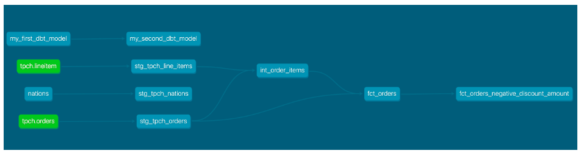

# demo-snowflake-dbt-integration

Repository to demo a dbt core workflow with snowflake.

Tutorial sources:
 - [dbt quickstart](https://quickstarts.snowflake.com/guide/accelerating_data_teams_with_snowflake_and_dbt_cloud_hands_on_lab/#0)
 - [video tutorial](https://www.youtube.com/watch?v=84RA7TuhCpg&t=587s&ab_channel=SnowflakeDevelopers)

## Prerequisites

- Snowflake account with source data loaded
- git repo with "main" and "development" branches
- python 3.6+
- venv (or other virtual environment manager) [recommended]

## Setup
install dbt for snowflake (assumes virtual environment is activated)
```bash
pip install dbt-snowflake
```
create a new folder [if exists] .dbt in the home directory of the user
```bash
mkdir -p ~/.dbt
```
create a new folder for the data modelling and change to new directory (assumes data was ingested in `01_ingest` folder)
```bash
mkdir -p 02_modelling_dbt
cd 02_modelling_dbt
```
initialize the dbt project
```bash
dbt init <project_name>
```
check if the dbt project was initialized correctly
```bash
dbt debug
```

## Architecture and Use Case Overview

The objective of this lab is to transform raw retail data into a consumable orders model that's ready for analysis.

We'll be utilizing the TPC-H dataset that comes out of the box with your Snowflake account and transform it using some of dbt's most powerful features.


The final deliverable for this exercise is:
- a fully functional dbt project with testing and documentation,
- experience with the dbt git workflow, 
- and dedicated development and production environments in Snowflake

here's the model lineage expected from this exercise.



**NB!**

Note for implementing the dbt git workflow in professional settings: 

- It may be required to write scripts to automate executions (avoid manual executions all the time)
- These scripts will likely need to include instructions on how to decide whether to continue or not.
- more effort is required to incude scheduling the execution, storing the execution results, storing logs, and publishing the freshness checks or documentation
- more effort is required to use VCS to effectively keep synchronization between environments and facilitate collaboration between the developers.
- more effort is required to display data lineage

## Useful dbt commands

install dbt dependencies
```bash
dbt deps
```
run dbt models [compile and deploy]
```bash
dbt run
```
This command will above:
- compile the models
- deploy the models to the target database, i.e Snowflake

compile dbt models
```bash
dbt compile
```

test dbt models
```bash
dbt test
```

if you want to run a specific model
```bash
dbt run --models <model_name>
```
the same applies for compile and test commands.

to create documentation
```bash
dbt docs generate
```


